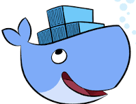

#  Welcome to CSCC WIIT-7501!

Happy to have you here! I put together some resources for class, so feel free to poke around.

- [git help](./git_help/README.md)
- [CSCC VM help](./vm_prep/README.md)

## more helpful information

These 12 weeks are going to fly by. Along the way you will be picking up some great tools of the trade that are not necessarily a part of the curriculum.

- git knowledge
- text manipulation with MarkDown
- linux commands
- nerdy vocabulary

Crucial to getting lab homework done is pick up a few git commands. Use the link about to get some indepth help, but also just keep in mind that we don't expect you to know everything immediately and that there is always help available. Same goes with the linux commands in the CSCC VM.

Markdown is nice to know too, but is very easy to understand. 

