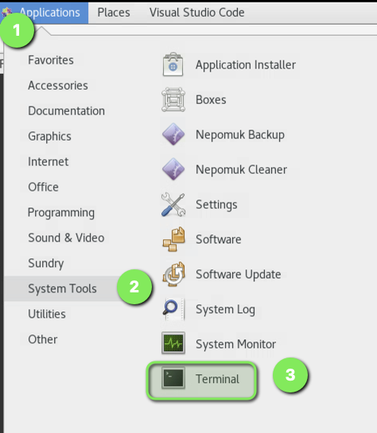

- [How to use git with lab homework](#how-to-use-git-with-lab-homework)
  - [Setup CSCC VM](#setup-cscc-vm)
  - [Create a GitHub SSH key](#create-a-github-ssh-key)
  - [Clone the git repo and create a working branch](#clone-the-git-repo-and-create-a-working-branch)
  - [Edits are made to the working branch](#edits-are-made-to-the-working-branch)
  - [Push the code up and create a Pull Request](#push-the-code-up-and-create-a-pull-request)
- [Here is the process in a diagram](#here-is-the-process-in-a-diagram)

# How to use git with lab homework

## Setup CSCC VM

There are a few pre-requisities for setting the CSCC VM. Lets get used to using the terminal. Open the terminal.



Let's setup our git username and email global settings. Run these commands in the CSCC VM, replacing with your name and CSCC email:

```bash
git config --global user.name "Your Name"
git config --global user.email "your.email@example.com"
```

Lastly, I like to work in a directory just off of my home directory. That way my files are just a few ```cd``` commands away.

I would suggest creating a class directory like ```mkdir wiit7501``` and creating a few sub-directories for labs and exercises. When a new lab starts, head into your labs directory, and execute your ```git clone``` command.

```bash
wiit7500
├── exercises
├── labs
└── temp
```


## Create a GitHub SSH key

There are a few different ways to use GitHub code. If you are a pro :sunglasses:, feel free to set up however you like. If you want something that just works, follow the instructions at this [GitHub documentation link for setting up an SSH Key in your CSCC VM](https://docs.github.com/en/authentication/connecting-to-github-with-ssh/adding-a-new-ssh-key-to-your-github-account?platform=linux). The instructions at the link, also send you to this step, [generating a new SSH key and adding it to the ssh-agent](https://docs.github.com/en/authentication/connecting-to-github-with-ssh/generating-a-new-ssh-key-and-adding-it-to-the-ssh-agent).

The basic steps are:

 1. Log into CSCC VM
    2. Log into github from the web browser in the CSCC VM
    3. Open a terminal in the CSCC VM
    4. Create a new ssh key in the terminal. [This link](https://docs.github.com/en/authentication/connecting-to-github-with-ssh/generating-a-new-ssh-key-and-adding-it-to-the-ssh-agent)
       1. ```ssh-keygen -t ed25519 -C "studentemail@students.cscc.edu"```
          1. accept all the defaults by clicking enter 3-4 times (save location, no password, etc)
       2. ```cat /home/CSCC/<student_user_name>/.ssh/id_ed25519.pub```
       3. Copy the cat command output, and paste into github. [this link](https://docs.github.com/en/authentication/connecting-to-github-with-ssh/adding-a-new-ssh-key-to-your-github-account?platform=linux)
    5. Here you have options
       1. Option one, add a ssh config file to your ```.ssh``` directory
          1. You can create one your own, or copy this one I included in the git repo.
          2. From this git repo, run ```cp git_help/ssh_config ~/.ssh/config && chmod 600 ~/.ssh/config```
       2. Or you can add the ssh key to your agent. [This link again](https://docs.github.com/en/authentication/connecting-to-github-with-ssh/generating-a-new-ssh-key-and-adding-it-to-the-ssh-agent)
          1. ```eval "$(ssh-agent -s)"```
          2. ```ssh-add ~/.ssh/id_ed25519```
    6. Test your access with ```ssh -T git@github.com```
       1. You should get something like ```Hi ewagner14-cscc! You've successfully authenticated, but GitHub does not provide shell access.```

## Clone the git repo and create a working branch

We follow these steps to get a local working copy of the code for the labs.

1. Open the URL for the homework
2. Grab the git clone command in the upper right.
    1. Click the green Code button to get a dropdown
    2. Click the SSH tab (recommendation)
    3. Copy the git@github.com string
        1. 
3. Go to your terminal in your workspace (ex: CSCC VM)
4. Navigate to your project directory (ex: ```cd labs/week3```)
5. Run the ```git clone``` command pasting the string you copied
    1. Now the repo should be down on your machine
    2. Use the command ```cd <git_repo>``` to enter the git repo
6. Create a working branch with the ```git checkout -b <new_branch_name>``` command
   1. The flag```-b``` is a shortcut to create and checkout a new branch.
7. Now you are ready to begin your work

## Edits are made to the working branch

This is where you really begin to work. Use tools, like text editor, vim, nano, or Visual Studio Code to edit yours files. If you don't know what to use, start with text editor. It is graphical and you can open multiple windows.


Begin working on your solutions in the new branch. List your available branches at the command line with: ``` git branch -v```

You can switch back and forth between branches. Use the command ```git checkout <branchname>```

With work either complete or you need some feedback, now you want to check the working branch code back into GitHub for collaboration.

To get the changes tracked in git, use the command ```git add .```. This will add all changes from your current path, to the current git branch.

Next, you commit the changes with ```git commit -m "Your commit message"```. This creates a trackable git commit! exciting! 🎉

## Push the code up and create a Pull Request

Now we get the code up to github with a push command:

```bash
git push -u origin <new_branch_name>
```

The new branch should show up in GitHub


To ask for a pull request, or collaborate with Eric on the lab, go to the repository on GitHub.

You should see a prompt to compare and create a pull request for your recently pushed branch.


Provide a title and description for your pull request. Make sure to @ewagner14-cscc and submit the PR.


# Here is the process in a diagram

