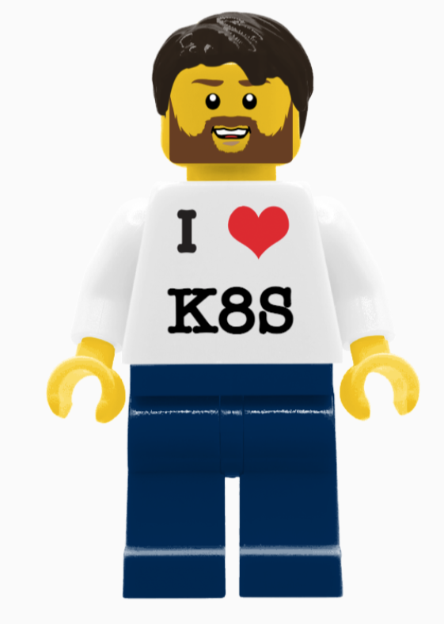

# How would you design a minifig?

Here is an image of it. 
| Username           | First Name        | Lego minifig |
| -------------------| ------------------| ---- |
| ewagner14    | Eric               |  |

## List-o-minifigs

Please update the table below with your minifigs. This exercise will show us how to use git. In it we will use git clone, git branch, and git push, and git pull requests.

| Username           | First Name        | Lego minifig |
| -------------------| ------------------| ---- |
| | | |