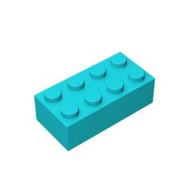

# What is your favorite lego piece?

My favorite is the 4 by 2 brick. I like to think of it as the foundation of everything lego.

Here is an image of it. 
| Username           | First Name        | Lego brick |
| -------------------| ------------------| ---- |
| ewagner14    | Eric               |  |

## List-o-bricks

Please update the table below with your favorite bricks. This exercise will show us how to use git. In it we will use git clone, git branch, and git push, and git pull requests.

| Username           | First Name        | Lego brick |
| -------------------| ------------------| ---- |
| asanchezsanchez    | Ana               |      |
| asharma25          | Alok              |      |
| bfernando          | Brinda            |      |
| bpetrick           | Benjamin          |      |
| cbadnehalmatapat   | Chandu Prasad     |      |
| drowswell          | David             |      |
| esaboleyjr         | Edward            |      |
| hmishra1           | Harshit           |      |
| hregupathy         | Hari              |      |
| jcollins117        | Joshua            |      |
| jmagoto            | Jason             |      |
| kjoseph6           | Kent              |      |
| ktomallo           | Kate              |      |
| kuthup             | Kurian            |      |
| mkandalai          | Murali            |      |
| phuizar            | Peter             |      |
| psiddavarapu       | Praveen           |      |
| rbrunner5          | Rebecca           |      |
| rrock1             | Robbie            |      |
| sloeffler3         | Scot              |      |
| twarren14          | Tyler             |      |
| vcherukuri         | Venkata Rajesh    |      |
| vhiremath          | Vishwesh          |      |
| yshinde            | Yuvaraj           |      |