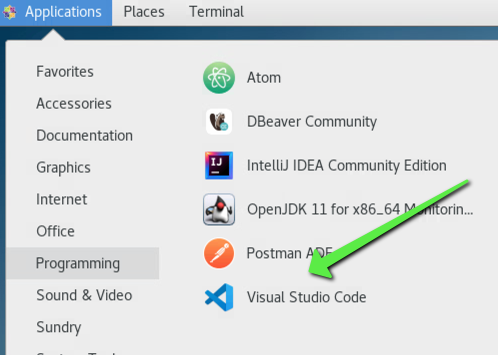
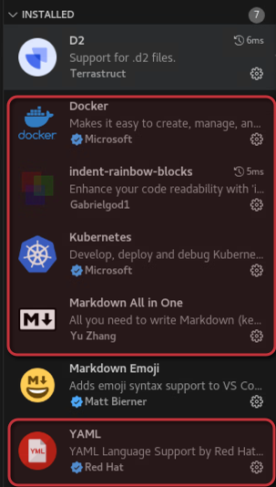

- [VM prep](#vm-prep)
- [Docker fix](#docker-fix)
- [installing DNF](#installing-dnf)
- [Installing EPEL sources](#installing-epel-sources)
- [No longer installing VS code](#no-longer-installing-vs-code)
- [UNTESTED (9/19/2024) installing zsh and oh-my-zsh](#untested-9192024-installing-zsh-and-oh-my-zsh)
  - [my copy of zshrc in repo](#my-copy-of-zshrc-in-repo)
- [Archived instructions](#archived-instructions)
  - [VS Code extentions](#vs-code-extentions)


# VM prep

A few goals for getting the CSCC Vm preparred and ready to go.
- easy to use
- familiar tools

# Docker fix

When you fist log in, ```docker``` commands will error out. To fix, we need to add your user to the docker group.

```bash
sudo usermod -aG docker $USER
```

Logout and log back in to use docker.

# installing DNF

If you do any googling on CentOS, the main install tool referenced is DNF. You can pretty much use ```yum``` as a substitue for ```dnf```.

```bash
sudo yum install -y dnf
```

Now, you can install using the ```dnf``` command.

# Installing EPEL sources

Gives access to more libs in dnf and yum

```sudo dnf install epel-release```

# No longer installing VS code

Because the VMs are using CentOS 7.9, which is out of support, a lot of install commands that rely on package managers will not work. 

For this class (Autumn 2024), lets concentrate on using tools available natively in the VM. We have some really good ones.

- Integrated Development Environment - use IntelliJ
  - Terminal included
  - git integration (GUI for git push, pull, branch, etc)
  - plugins available
- Command line tools
  - We tested the install of all the needed libs for the course, they worked great (tested 9/19/2024)
  - git, kubectl, minikube, helm, etc all tested well
  - VIM and the Edit program are also available on the VM

# UNTESTED (9/19/2024) installing zsh and oh-my-zsh

**THIS IS ADVANCED** You could break your VM here, and it may need a reset. 

I like zsh instead of bash for my shell. To install that and to get it running I had to tweak a few things.

First install zsh ```sudo dnf install -y zsh```

Second, install [oh-my-zsh](https://ohmyz.sh/#install). You will get a command like the below.

```bash
sh -c "$(curl -fsSL https://raw.githubusercontent.com/ohmyzsh/ohmyzsh/master/tools/install.sh)"
```

This command errors out on the ```chsh``` command. that is because we use our home dirs a little differently. Our home is in /home/CSCC/username

To fix this, I editted the ```/etc/passwd``` file. **THIS IS THE DANGEROUS PART**

The file needs my UID and that is different for each user. Run the ```id -u``` command and make note of the output

Edit passwd file with ```sudo vim /etc/passwd```. My user was not in the file, so I added it.

At the bottom of the file with updated path to of ```/bin/zsh```, I added my user.

```bash
# example:
<cscc-username>:x:<UID>:<UID>:<name>:/home/CSCC/<cscc-username>:/bin/zsh

# my entry:
ewagner14:x:16777218:16777218:Eric:/home/CSCC/ewagner14:/bin/zsh
```

After this, logout of the VM, and log back in to use the new shell.

To play with your oh-my-zsh setup, [use this link to get started](https://github.com/ohmyzsh/ohmyzsh/wiki)

## my copy of zshrc in repo

I included a copy of my zsh setup. Ill try to keep it updated.

In there is an alias command to put my CSCC pw in my clipboard. To get it to work, take the cscc-wp.txt file in this repo, copy it to your home dir, chmod to only read/write to your user (```chmod 600 cscc-pw.txt```), and install the xsel command (```sudo dnf install xsel```). I find it useful to have my CSCC pw in my clipboard in the CSCC VM environment, so that is why I did this work around.

# Archived instructions

VS Code is my IDE of choice (integrated development environment). If you want to give it a shot in the VM, install using the below. [I got the instructions here](https://code.visualstudio.com/docs/setup/linux#_rhel-fedora-and-centos-based-distributions)

```bash
sudo rpm --import https://packages.microsoft.com/keys/microsoft.asc
sudo sh -c 'echo -e "[code]\nname=Visual Studio Code\nbaseurl=https://packages.microsoft.com/yumrepos/vscode\nenabled=1\ngpgcheck=1\ngpgkey=https://packages.microsoft.com/keys/microsoft.asc" > /etc/yum.repos.d/vscode.repo'
dnf check-update
sudo dnf install code
```

VS code is now in the applications menu



## VS Code extentions

I would recommend a few extensions if you choose to go with VS Code



- docker
- indent-rainbow-blocks (makes things so much more readable)
- kubernetes
- markdown all-in-one 
- yaml


